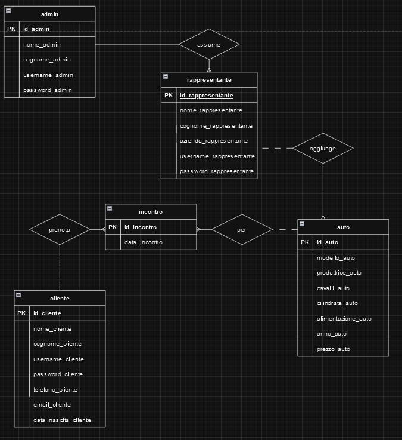
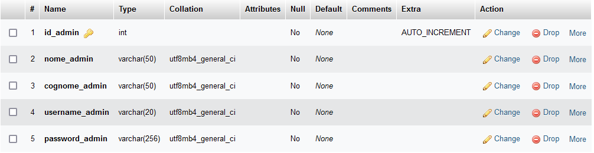
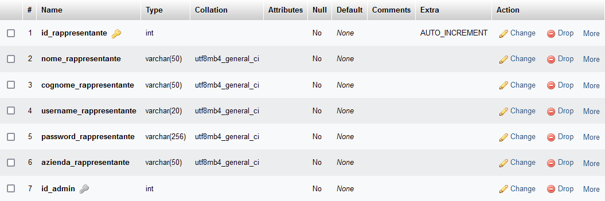
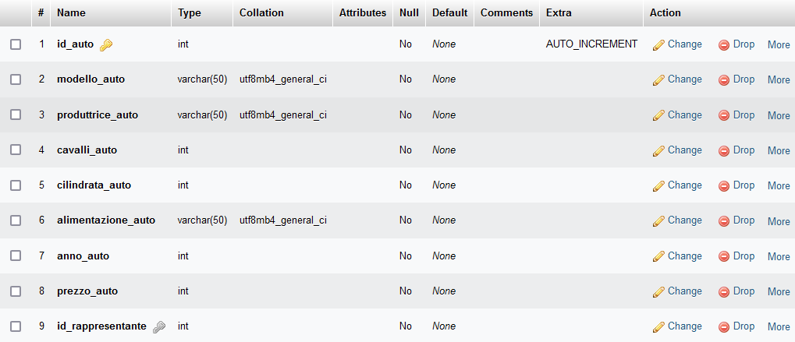
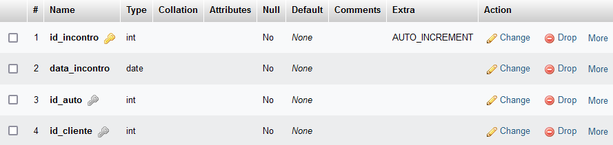
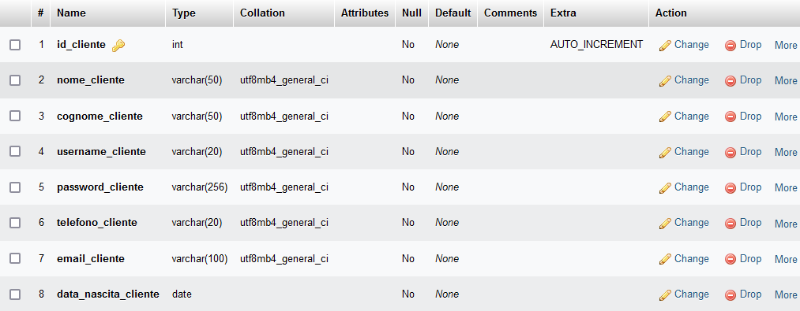

## Concessionaria Acquafredda
“Concessionaria Acquafredda” è il progetto di informatica che ho scelto di presentare per gli esami di stato 2023-24. Ho deciso di ricreare in maniera molto semplice la struttura di un ipotetico sito web di una concessionaria di auto inserendo anche le pagine di gestione delle attività dei dipendenti (rappresentanti di auto) e dell'admin.

Il progetto è disponibile online cliccando [qui](https://acquafreddafrancesco.altervista.org/).

Per la realizzazione del sito ho utilizzato:
- HTML
- CSS
- JavaScript
- PHP
- MySQL

***

### SPIEGAZIONE
Ho strutturato il sito in modo tale che i visitatori non loggati possano solamente avere informazioni sulla concessionaria e vedere la lista delle auto. Se il visitatore crea un account potrà prenotare uno o più appuntamenti in sede per vedere le auto. Le pagine delle auto sono gestite dai rappresentanti, dipendenti della concessionaria che lavorano per una sola casa produttrice (es Volkswagen, Fiat ...), i quali possono aggiungere, eliminare, modificare le auto e visualizzare le prenotazioni per le proprie auto. L’admin invece, ipoteticamente il proprietario della concessionaria, ha tutti i privilegi possibili: può aggiungere i rappresentanti e eventualmente modificare i loro dati, modificare o eliminare auto e visualizzare l'intero elenco delle prenotaazioni dei clienti.

***

### Funzionalità admin
L'admin ha maggiori privilegi rispetto agli altri utenti, infatti può:
- Visualizzare l'elenco di tutte le auto, modificarle o eliminarle;
- Creare i profili dei rappresentanti (dipendenti);
- Visualizzare l'elenco dei rappresentanti, modificarli o eliminarli;
- Visualizzare l'elenco delle prenotazioni dei clienti.

***

### Funzionalità rappresentante
Il rappresentante, essendo un dipendente, ha meno privilegi dell'admin ma può:
- Visualizzare le auto della casa produttrice per la quale lavora, modificarle o eliminarle;
- Visualizzare le prenotazioni dei clienti le auto da lui aggiunte.

***

### Funzionalità cliente
Il cliente è un utente di base e può:
- Visualizzare il catalogo delle auto;
- Prenotare un incontro con una delle auto ed eventualmente annullarlo;
- Modificare i dati del suo profilo.

***

### Funzionalità utente non loggato
L'utente non loggato, ovvero il visitatore occasionale, può solamente:
- Visualizzare l'elenco delle auto della concessionaria senza però poter effettuare una prenotazione;
- Registrarsi per poter accedere alle funzionalità del cliente.

***

### SCHEMA E/R

***

### SCHEMA LOGICO

admin (**id_admin**, nome_admin, cognome_admin, username_admin, password_admin)

rappresentante (**id_rappresentante**, nome_rappresentante, cognome_rappresentante, username_rappresentante, password_rappresentante, azienda_rappresentante, _id_admin_)

auto (**id_auto**, modello_auto, produttrice_auto, cavalli_auto, cilindrata_auto, alimentazione_auto, anno_auto, prezzo_auto, _id_rappresentante_)

incontro (**id_incontro**, data_incontro, _id_auto_, _id_cliente_)

cliente (**id_cliente**, nome_cliente, cognome_cliente, username_cliente, password_cliente, telefono_cliente, email_cliente, data_nascita_cliente)

***

### SCHEMA FISICO DATABASE

