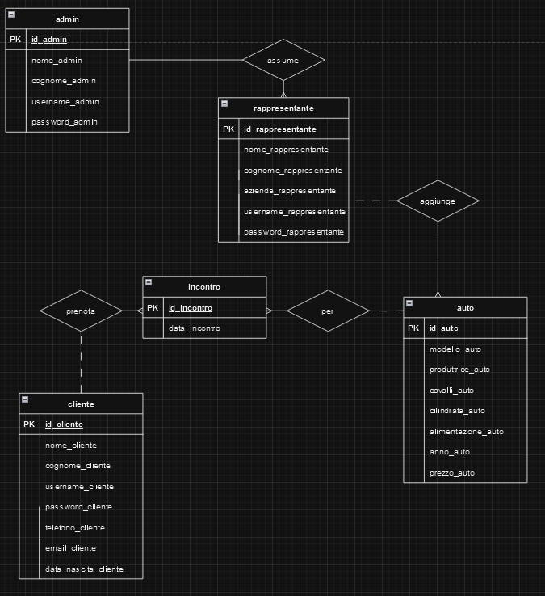

## Concessionaria Acquafredda
Concessionaria Acquafredda è il progetto che ho deciso di portare in informatica per gli esami di stato 2023-24. Ho deciso di ricreare in maniera molto semplice la struttura di un ipotetico sito web di una concessionaria di auto, inserendo anche le pagine di gestione per i dipendenti (rappresentanti di auto) e per l'admin.
Per la realizzazione del sito ho utilizzato:
- HTML
- CSS
- JavaScript
- PHP
- MySQL

***

### ANALISI E SPIEGAZIONE
Ho strutturato il sito in modo tale che i visitatori non loggati, possano solamente avere informazioni sulla concessionaria e vedere la lista delle auto. Se il visitatore crea un account, egli potrà prenotare uno o più incontri in sede per vedere una o più auto. Le auto sono invece gestite dai rappresentanti, dipendenti della concessionaria che lavorano per una sola casa produttrice (es Volkswagen, Fiat ...), i quali possono aggiungere, eliminare, modificare le auto e visualizzare le prenotazioni per proprie auto. l'admin invece, ipoteticamente il proprietario della concessionaria, ha tutti i privilegi possibili: egli può aggiungere i rappresentanti e eventualmente modificare i loro dati, modificare o eliminare auto, e visualizzare l'intero elenco delle prenotaazioni dei clienti.

***

### SCHEMA E/R

***

### SCHEMA LOGICO

admin (**id_admin**, nome_admin, cognome_admin, username_admin, password_admin)

rappresentante (**id_rappresentante**, nome_rappresentante, cognome_rappresentante, username_rappresentante, password_rappresentante, azienda_rappresentante, _id_admin_)

auto (**id_auto**, modello_auto, produttrice_auto, cavalli_auto, cilindrata_auto, alimentazione_auto, anno_auto, prezzo_auto, _id_rappresentante_)

incontro (**id_incontro**, data_incontro, _id_auto_, _id_cliente_)

cliente (**id_cliente**, nome_cliente, cognome_cliente, username_cliente, password_cliente, telefono_cliente, email_cliente, data_nascita_cliente)
